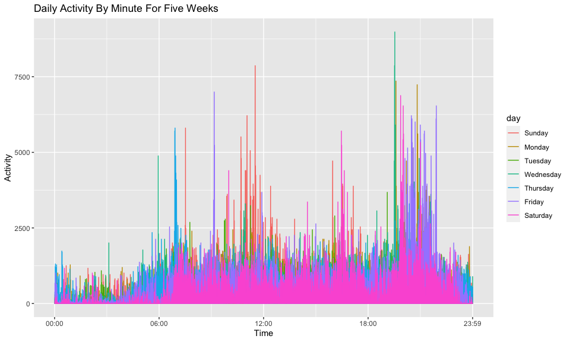

p8105\_hw3\_yz4183
================
Yuchen Zheng
10/14/2021

``` r
library(p8105.datasets)
library(tidyverse)
library(dplyr)
library(lubridate)
```

## Problem 1

``` r
data("instacart")
```

1.  A short description of the instacart dataset

The instacart dataset contains grocery orders information for users in
2017. The dataset has 1384617 observations and 15 columns. Each row is
an item that was ordered and each column gives information for that item
such as the name of the product, the department the item is from and the
user id for the item. Some noteworthy key variables are reordered which
indicates whether the item was ordered multiple times, order\_dow which
indicates day of week the order was placed and day\_since\_prior\_order
which indicates number of days since last order.

I made a plot to see on which day of the week users usually ordered on
instacart.

``` r
instacart %>%
  select(user_id, order_id, order_dow) %>% 
  mutate(day_number = order_dow + 1) %>% 
  mutate(day_of_week = wday(day_number, label = TRUE)) %>% 
  distinct() %>% 
  group_by(day_of_week) %>% 
  summarise(count = n()) %>% 
  ggplot(aes(x = day_of_week, y = count)) + geom_bar(stat = "identity") + labs(x = "Day of Week", y = "Count", title = "Numbers of Orders on Each day of a Week")
```

<!-- -->

The plot shows most users made their orders on Sunday.

I also made a plot to see how long would the users order again since
their last orders.

``` r
instacart %>%
  select(user_id, order_id, days_since_prior_order) %>% 
  distinct() %>% 
  group_by(days_since_prior_order) %>% 
  summarise(count = n()) %>% 
  ggplot(aes(x = days_since_prior_order, y = count)) + geom_bar(stat = "identity") + labs(x = "Days Since Last Order", y = "Count", title = "Number of Days Since Last Order")
```

<!-- -->

The plot shows most people reorder after 30 days and some people reorder
after 8 days.

2.  How many aisles are there, and which aisles are the most items
    ordered from?

``` r
num_aisle = 
  instacart %>% 
  select(aisle) %>% 
  n_distinct()

instacart %>%
  group_by(aisle) %>%
  summarise(num_aisle = n()) %>%
  arrange(desc(num_aisle)) %>% 
  filter(row_number() == 1)  
```

    ## # A tibble: 1 × 2
    ##   aisle            num_aisle
    ##   <chr>                <int>
    ## 1 fresh vegetables    150609

There are 134 aisles and the most ordered items are from fresh
vegetables aisle.

3.  A plot that shows the number of items ordered in aisles with more
    than 10000 items ordered.

``` r
instacart %>%
  group_by(aisle) %>%
  summarise(num_of_orders = n()) %>%
  filter(num_of_orders > 10000) %>% 
  arrange(desc(num_of_orders)) %>%
  ggplot(aes(x = reorder(aisle, num_of_orders), y = num_of_orders)) + geom_bar(stat = "identity") + coord_flip() + labs(x = "Aisle", y = "Num of Orders", title = "Number of Items Ordered in Each Aisle") 
```

<!-- -->

4.  A table that shows the three most popular items in each of the
    aisles “baking ingredients”, “dog food care”, and “packaged
    vegetables fruits”

``` r
three_most_pop_df = instacart %>%
  filter(aisle == "baking ingredients" | 
         aisle == "dog food care" |
         aisle == "packaged vegetables fruits") %>% 
  group_by(aisle, product_name) %>%
  summarise(num_of_orders = n()) %>%
  arrange(desc(num_of_orders), .by_group = TRUE) %>% 
  slice(which.max(num_of_orders))

three_most_pop_df %>% knitr::kable(digits = 0)
```

| aisle                      | product\_name                                 | num\_of\_orders |
|:---------------------------|:----------------------------------------------|----------------:|
| baking ingredients         | Light Brown Sugar                             |             499 |
| dog food care              | Snack Sticks Chicken & Rice Recipe Dog Treats |              30 |
| packaged vegetables fruits | Organic Baby Spinach                          |            9784 |

5.  A table that shows the mean hour of the day at which Pink Lady
    Apples and Coffee Ice Cream are ordered on each day of the week

``` r
hour_df = 
  instacart %>%
  filter(product_name == "Pink Lady Apples" | product_name == "Coffee Ice Cream") %>% 
  select(product_name, order_dow, order_hour_of_day) %>% 
  group_by(product_name, order_dow) %>% 
  summarise(mean_hour_of_day = round(sum(order_hour_of_day)/n(), digit = 0)) %>%
  mutate(day_number = order_dow + 1) %>% 
  mutate(day_of_week = wday(day_number, label = TRUE)) %>% 
  select(-c(order_dow, day_number)) %>% 
  pivot_wider(names_from = "day_of_week", values_from = "mean_hour_of_day") %>% 
  relocate(product_name, Sun, Mon, Tue, Wed, Thu, Fri, Sat)

hour_df %>% knitr::kable(digits = 0)
```

| product\_name    | Sun | Mon | Tue | Wed | Thu | Fri | Sat |
|:-----------------|----:|----:|----:|----:|----:|----:|----:|
| Coffee Ice Cream |  14 |  14 |  15 |  15 |  15 |  12 |  14 |
| Pink Lady Apples |  13 |  11 |  12 |  14 |  12 |  13 |  12 |

## Problem 2

1.  Load and clean the data; focus on the “Overall Health” topic;

``` r
data("brfss_smart2010")
```

``` r
brfss_smart = 
  brfss_smart2010 %>% 
  janitor::clean_names() %>%
  filter(topic == "Overall Health") %>% 
  mutate(response = factor(response, levels = c("Poor", "Fair", "Good", "Very good" , "Excellent"))) %>% 
  rename(state = locationabbr, county = locationdesc)
```

``` r
#check how many types of response are there
unique(pull(brfss_smart, response))
```

    ## [1] Excellent Very good Good      Fair      Poor     
    ## Levels: Poor Fair Good Very good Excellent

2.  In 2002, which states were observed at 7 or more locations? What
    about in 2010?

``` r
brfss_02 = brfss_smart %>% 
  filter(year == "2002") %>% 
  mutate(county = substr(county, start = 5, stop = nchar(county))) %>% 
  select(year, state, county) %>%
  distinct() %>% 
  group_by(state) %>% 
  summarize(num_locations = n()) %>% 
  filter(num_locations >= 7)

brfss_02 %>% knitr::kable(digits = 0)
```

| state | num\_locations |
|:------|---------------:|
| CT    |              7 |
| FL    |              7 |
| MA    |              8 |
| NC    |              7 |
| NJ    |              8 |
| PA    |             10 |

``` r
brfss_10 = brfss_smart %>% 
  filter(year == "2010") %>% 
  mutate(county = substr(county, start = 5, stop = nchar(county))) %>% 
  select(year, state, county) %>%
  distinct() %>% 
  group_by(state) %>% 
  summarize(num_locations = n()) %>% 
  filter(num_locations >= 7)

brfss_10 %>% knitr::kable(digits = 0)
```

| state | num\_locations |
|:------|---------------:|
| CA    |             12 |
| CO    |              7 |
| FL    |             41 |
| MA    |              9 |
| MD    |             12 |
| NC    |             12 |
| NE    |             10 |
| NJ    |             19 |
| NY    |              9 |
| OH    |              8 |
| PA    |              7 |
| SC    |              7 |
| TX    |             16 |
| WA    |             10 |

3.  Construct a dataset that is limited to Excellent responses, and
    contains year, state, and a variable that averages the data\_value
    across locations within a state. Make a “spaghetti” plot of this
    average value over time within a state.

``` r
brfss_plot_df = 
  brfss_smart %>%
  filter(response == "Excellent") %>% 
  group_by(year, state) %>%
  mutate(mean_value = mean(data_value, na.rm = TRUE)) %>%
  select(year, state, mean_value) %>%
  distinct() %>% 
  arrange(year, state)

brfss_plot_df %>% 
  ggplot(aes(x = year, y = mean_value, color = state)) + geom_line() + labs(x = "Year", y = "Mean", title = "Mean Data Values Over the Years By State")
```

<!-- -->

4.  Make a two-panel plot showing, for the years 2006, and 2010,
    distribution of data\_value for responses (“Poor” to “Excellent”)
    among locations in NY State.

``` r
ny_brfss = 
  brfss_smart %>% 
  filter((year == "2006" | year == "2010") & state == "NY") %>% 
  select(year, county, response, data_value) 

ny_brfss %>% 
  ggplot(aes(x = response, y = data_value, color = county)) + 
  geom_point() +
  facet_grid(~year) +
  labs(x = "Response", y = "Data Value", title = "Data Values Among Locations in NY State in 2006 and 2010")
```

<!-- -->

## Problem 3

1.  Load, tidy, and wrangle the data in accelerometer dataset.

``` r
accel_df = 
  read_csv("accel_data.csv") %>% 
  janitor::clean_names() %>% 
  mutate(day_type = ifelse((day == "Saturday" | day == "Sunday"), "weekend", "weekday")) %>% 
  relocate(week, day_id, day, day_type) %>% 
  mutate(day = factor(day, levels = c("Sunday", "Monday", "Tuesday", "Wednesday" , "Thursday", "Friday", "Saturday"))) %>% 
  mutate(day_type = factor(day_type, levels = c("weekday", "weekend"))) %>% 
  mutate(week = as.character(week))
```

The final dataset has 35 observations and 1444 columns. Each row is a
record for each day of the five-week study period. The first four
columns give information of the day such as week number and day id and
the rest of 1440 columns contain information for activity value for each
minute of the day.

2.  Using your tidied dataset, aggregate accross minutes to create a
    total activity variable for each day, and create a table showing
    these totals. Are any trends apparent?

``` r
accel_by_day = 
  accel_df %>% 
  rowwise() %>% 
  mutate(total_activity = sum(across(activity_1:activity_1440))) %>% 
  select(week, day, total_activity, day_type) %>%
  pivot_wider(names_from = "week", values_from = "total_activity") %>%
  arrange(day) %>% 
  rename(week_1 = "1", week_2 = "2", week_3 = "3", week_4 = "4", week_5 = "5") 

accel_by_day %>% knitr::kable(digits = 0)
```

| day       | day\_type | week\_1 | week\_2 | week\_3 | week\_4 | week\_5 |
|:----------|:----------|--------:|--------:|--------:|--------:|--------:|
| Sunday    | weekend   |  631105 |  422018 |  467052 |  260617 |  138421 |
| Monday    | weekday   |   78828 |  295431 |  685910 |  409450 |  389080 |
| Tuesday   | weekday   |  307094 |  423245 |  381507 |  319568 |  367824 |
| Wednesday | weekday   |  340115 |  440962 |  468869 |  434460 |  445366 |
| Thursday  | weekday   |  355924 |  474048 |  371230 |  340291 |  549658 |
| Friday    | weekday   |  480543 |  568839 |  467420 |  154049 |  620860 |
| Saturday  | weekend   |  376254 |  607175 |  382928 |    1440 |    1440 |

There seems to be no apparent trends as it was shown in the table.

3.  Make a single-panel plot that shows the 24-hour activity time
    courses for each day and use color to indicate day of the week and
    describe any patterns or give conclusions.

``` r
accel_long = 
  accel_df %>% 
  pivot_longer(activity_1:activity_1440, names_to = "minute_of_day", values_to = "activity") %>% 
  mutate(minute = as.numeric(substr(minute_of_day, start = 10, stop = nchar(minute_of_day))))
  
accel_long %>% 
  ggplot(aes(x = minute, y = activity, color = day)) + 
  geom_line() +
  scale_x_continuous(
    breaks = c(0, 360, 720, 1080, 1440),
    labels = c("00:00", "06:00", "12:00", "18:00", "23:59")) +
  labs(x = "Time", y = "Activity", title = "Daily Activity By Minute For Five Weeks")
```

<!-- -->
